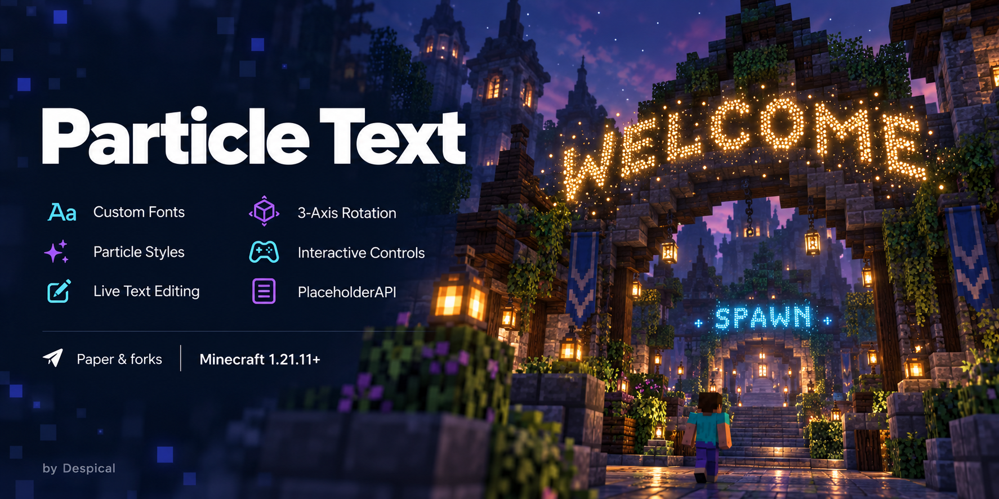

# Particle Text

[](https://github.com/Despical/ParticleText/actions/workflows/build.yml)


[](LICENSE)



Persistent particle text for Paper, created by **Despical**. Add a welcome sign,
mark an entrance, or display live server information. Customize each renderer
in game through commands, interactive chat cards, or an inventory menu.

## Features

- Configurable font family, style, size, particle, spacing, and text inversion.
- Per-renderer position, facing, three-axis rotation, and enabled state.
- Aikar commands with typed Paper Brigadier arguments and permission-aware completion.
- Paginated help and renderer lists, hover details, and management buttons.
- A shared particle scheduler with viewer-distance filtering and a global packet budget.
- Validated configuration snapshots and atomic renderer-file replacement.
- Optional PlaceholderAPI text resolution and a native `particletext` expansion.
- Clear error responses when a renderer already has the requested state or setting.

## Installation

Use **Java 25 or newer** and **Paper 1.21.11 or newer**. Put the shaded
`particle-text-2.0.2.jar` in the server's `plugins` folder and restart.
PlaceholderAPI is optional. The Java runtime must include `java.desktop`
for font rasterization. Folia is not supported.

## Commands

`/particletext` is an alias of `/pt`. IDs use lowercase letters, digits,
underscores, and hyphens, with a maximum of 32 characters.

| Command | Description | Permission suffix |
| --- | --- | --- |
| `/pt create <id> <text>` | Create text at your position | `create` |
| `/pt delete <id>` | Delete a saved renderer | `delete` |
| `/pt list [page]` | Browse saved renderers | `list` |
| `/pt info <id>` | Show details and management buttons | `info` |
| `/pt menu` | Open the inventory menu | `menu` |
| `/pt teleport <id>` | Teleport to a renderer | `teleport` |
| `/pt tphere <id>` | Move a renderer to your position | `teleport` |
| `/pt move <id> <direction> [amount]` | Move relative to your facing | `edit` |
| `/pt text <id> <text>` | Update the text | `edit` |
| `/pt setsize <id> <scale>` | Set spacing between particle pixels | `edit` |
| `/pt font <id> <name> <style> <size>` | Set the text font | `edit` |
| `/pt fonts` | List installed font families | `edit` |
| `/pt particle <id> <particle>` | Set a data-free particle | `edit` |
| `/pt enabled <id> <true\|false>` | Show or hide a renderer | `edit` |
| `/pt inverted <id> <true\|false>` | Invert text foreground/background | `edit` |
| `/pt rotate <id> <x\|y\|z> <angle>` | Set an axis rotation in degrees | `edit` |
| `/pt reload` | Validate and reload files | `reload` |
| `/pt help [page]` | Show available commands | `help` |
| `/pt version` | Show the installed version | `version` |

Permissions use `particletext.command.<suffix>`. `particletext.admin` grants all
administrative commands; `particletext.*` includes it. Completion additionally
uses `particletext.command.tabcomplete`. Menu teleport and toggle clicks check
their own action permissions. Version is available to everyone by default.

Directions are `forward`, `backward`, `left`, `right`, `up`, and `down`.
Font styles are `PLAIN`, `BOLD`, `ITALIC`, and `BOLD_ITALIC`.
Quote font names containing spaces.

```text
/pt create welcome Welcome to the server
/pt font welcome "DejaVu Sans" BOLD 24
/pt particle welcome END_ROD
/pt move welcome up 1
/pt rotate welcome y 45
```

## Configuration

| File | Purpose |
| --- | --- |
| `config.yml` | Rendering budgets, defaults, chat pagination, menu materials and sounds |
| `messages.yml` | MiniMessage chat, help, hover text, buttons, menu names and lore |
| `renderers.yml` | Saved text, transform, font, particle, and state |

Run `/pt reload` after editing. Missing settings and message keys use bundled
defaults in memory without overwriting your files. Invalid YAML, value types,
out-of-range settings, or invalid renderer records reject the reload and keep
the active settings, messages, and records. A successful reload rebuilds the
text renderers from the validated snapshot.

Existing text records remain compatible. Renderer-specific defaults are copied
only at creation; changing defaults does not replace existing fonts or transforms.
Use `%name%` or `<name>` for message variables. User input and PlaceholderAPI
output are inserted as literal text; explicitly built chat actions retain their
Adventure click and hover events. An empty message disables that output.

The point cap applies to each renderer; the shared packet cap counts each point
sent to each viewer. Under heavy load, renderer and point cursors rotate so the
same text does not always lose its turn. An unloaded renderer world is skipped
until it becomes available. Back up `renderers.yml` when moving servers.

## PlaceholderAPI

Renderer text resolves global placeholders periodically. It is shared content,
so it does not use a separate viewer context for each player.

| Placeholder | Result |
| --- | --- |
| `%particletext_total%` | Saved renderer count |
| `%particletext_enabled%` | Enabled renderer count |
| `%particletext_disabled%` | Disabled renderer count |
| `%particletext_nearest_id%` | Nearest renderer ID in the player's world |
| `%particletext_nearest_text%` | Nearest renderer's saved text |
| `%particletext_nearest_distance%` | Distance to that renderer |
| `%particletext_renderer:<id>:<field>%` | `text`, `particle`, `scale`, `enabled`, `inverted`, or `world` |

## Building

```shell
./gradlew clean build javadocJar --no-daemon --console=plain
```

On Windows use `gradlew.bat`. Build output includes the shaded plugin, a plain
development JAR, and opt-in Javadocs. Install the shaded plugin JAR.
The build uses Java 25, Gradle Groovy, Shadow, Aikar ACF, Adventure, and bStats;
the management menu uses Despical's Inventory Framework.

See [CONTRIBUTING.md](CONTRIBUTING.md), [SECURITY.md](SECURITY.md), and
[CODE_OF_CONDUCT.md](CODE_OF_CONDUCT.md). Particle Text is licensed under
[GPL-3.0-or-later](LICENSE).
